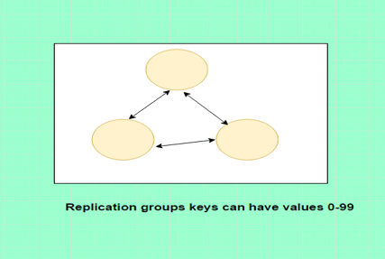
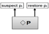
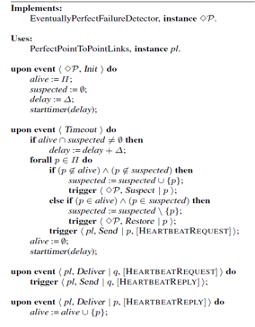

\clearpage

# Introduction

In this project, we are going to build a partitioned distributed key-value store using the Kompics framework for Java. The main property is to follow linearizability in operation semantics. The distributed hash table (DHT) is composed of servers and these will be referred to as nodes throughout this report. We have decided on implementing the DHT as a set of replication groups which are coordinated by a leader node.

# Infrastructure

Each node in the DHT consists of a key-value service and an overview manager.

The key-value service manages the key-value store and performs PUT and GET operations which are sent to it. PUT puts a given key-value pair in the storage and GET gets a value paired to a given key. In the current implementation keys can have a value in the range 0 - 99, mainly for easing the process of testing.

The overview manager communicates with other nodes in the network, it's responsibilities include routing operations and detecting failures.

Having a system where nodes are distributed over an overlay network results in some complex issues which needs to be addressed. A few of these issues are: reliability, scalability, linearizability and performance.

## Reliability

Nodes might crash. To survive this, the system needs to replicate its data over multiple nodes. This is achieved by having replication groups. In each replication group there are a number of nodes which are all responsible for storing keys in a common range. Thus if one node crashes, there should always be a backup of it in its replication group. However, this backup node may eventually crash as well. To avoid the scenario where every node in a replication group is dead the system needs to re-configure itself.

Another problem here is that the replicas needs to stay consistent. Consistency can be attained in multiple ways. For example, whenever a node receives a put operation, it updates its storage and broadcasts its state change to all nodes in its replication group. Another solution is to broadcast the PUT operation instead.

As a principle, values in the system should have a replication degree $\delta$. Each value should be replicated $\delta$ number of times. What the replication degree implies is that there should at any given point in execution be at least $\delta$ number of live nodes in each replication group. Generally, the replication degree should at least be 3, thus there should at least always be 3 nodes alive in each replication group.

## Scalability

If a node joins or dies, it will affect the scale of the system. As previously mentioned, the replication degree must be upheld. This implies that if there is a group of 3 nodes and 1 dies, the 2 remaining nodes must migrate to other groups. Likewise, if a new node joins and there is a group of 5 nodes, this group should split into 2 groups of 3. In this system, a leader node is designated to coordinate migration of nodes. How the migration should be implemented and whether the leader should monitor the replication groups has not yet been decided upon.

Initially, the bootstrap server, i.e the server who sets up the system, becomes the leader. If this node crashes, another node needs to take its place. Thereby the leader needs to be monitored by all other nodes. Another issue here is to decide which node should be elected the leader. Generally, the solution to a problem like this is to assign each node a unique rank and always select the node with the highest rank. To avoid having to explicitly give each node a unique rank, the port number can be used as a rank since it is unique to each node. Hence, the node with the highest port number should be elected.

## Linearizability

Multiple operations which are performed on the key-value store concurrently must
not cause conflicts with each other. Each operation must happen atomically to
isolate it from other operations.

When an external client sends an operation to the system, it operation is first delivered to the leader node. The leader node then routes the operation to the replication group responsible for it. Then, the leader must wait for acknowlegements from all nodes in the replication group. This only covers serialization, the rest will be decided on later.

## Performance

The performance depends on multiple factors. One factor is how keys are distributed in the system. The goal is to distribute the keys as evenly as possible. For this, a hashing function is used.

## Failure Detection

To detect failures, an Eventually Perfect Failure Detector (EPFD) is used.

An eventually perfect failure detector abstraction detects crashes accurately after some a priori unknown point in time, but may make mistakes before that time. This captures the intuition that, most of the time, timeout delays can be adjusted so they can lead to accurately detecting crashes. to implement an eventually perfect failure detector abstraction, the idea is to also use a timeout, and to suspect processes that did not send heartbeat messages within a timeout delay. The original timeout might be set to a short duration if the goal is to react quickly to failures. Using this failure detect we mark nodes as suspicious before even finally declaring that one has crashed. This algorithm is described in @fig:epfd2. By using an EPFD, the system will be fault tolerant up to (N-1)/2 failing nodes.

{#fig:epfd2}

# Goals

In the system we are going to build there are some basic requirements which must be satisfied. By satisfying these requirements, the system will be able to handle data in highly available, scalable, responsive manner. Reconfiguration of the system whenever a node joins or fails is an important aspect for distributed key value store. The key-value store will be fault tolerant up to (N-1)/2 failing nodes within application group. Availability can be further increased by extending this solution with reconfiguration support for the replication groups.

# Conclusion

This project assignment focuses on learning the tools and tricks of building distributed systems by using multiple common distributed systems algorithms.
